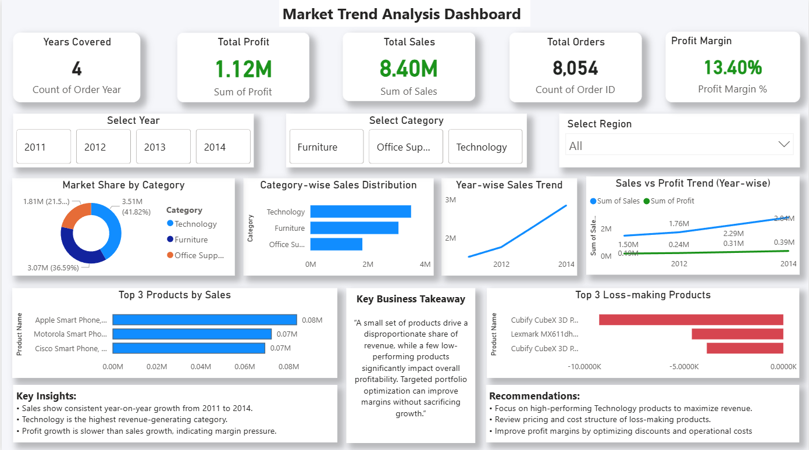
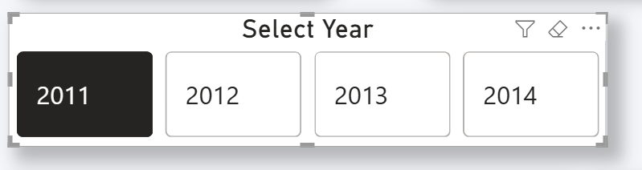
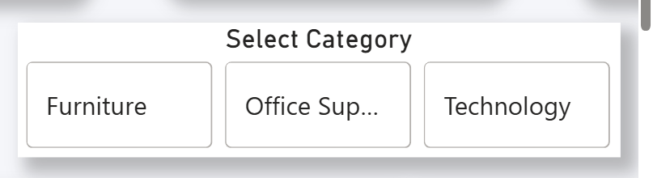
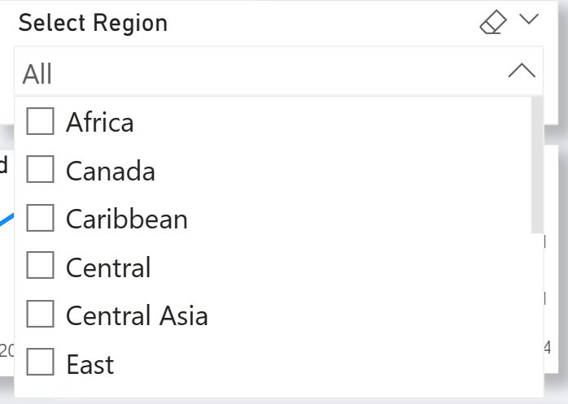
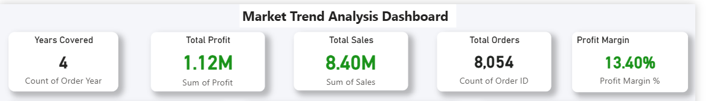
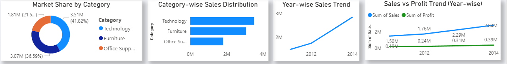
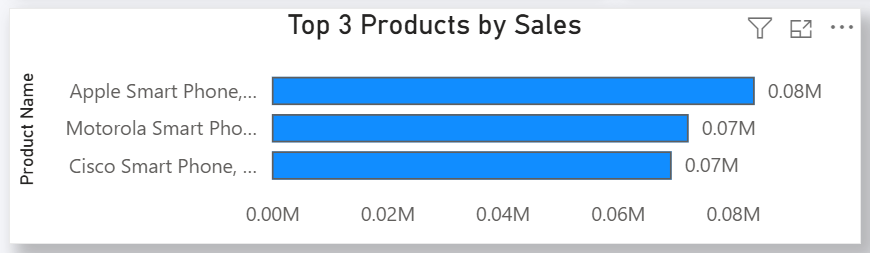
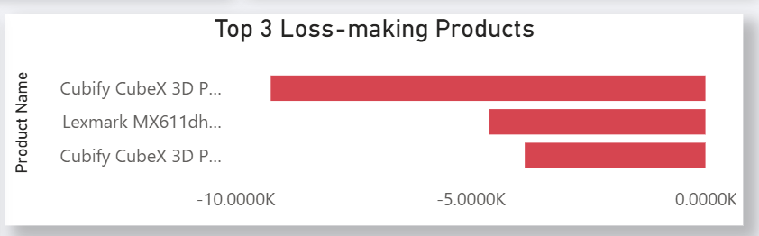
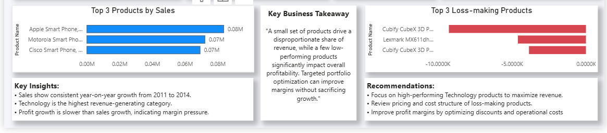

# 📊 Market Trend Analysis Dashboard (SQL & Power BI)

## 📌 Project Overview
This project presents an interactive market trend analysis dashboard built using SQL and Power BI.
It analyzes multi-year sales data to identify trends, performance drivers, and improvement opportunities.

---

## 🛠️ Tools & Technologies
- MySQL
- Power BI Desktop
- Power BI Service (Publish to Web)
- GitHub

---
## 🔄 Project Workflow (End-to-End)

1. **Data Ingestion & Validation (SQL)**
   - Imported multi-year sales data into SQL Server
   - Verified schema, row counts, and data completeness

2. **Data Preparation (SQL)**
   - Cleaned invalid sales records
   - Extracted time-based attributes (Order Year)
   - Prepared category and product-level aggregations

3. **Analytical Querying (SQL)**
   - Calculated KPIs (Sales, Profit, Orders, Profit Margin)
   - Generated year-wise trends
   - Computed category market share
   - Identified top-performing and loss-making products

4. **Visualization Layer (Power BI)**
   - Connected Power BI to SQL data
   - Built interactive KPI cards
   - Created trend, comparison, and distribution visuals
   - Implemented slicers for Year, Category, and Region

5. **Insight Generation**
   - Analyzed growth patterns and margin behavior
   - Highlighted revenue concentration risks
   - Added business insights and actionable recommendations

## 🌐 Live Dashboard
🔗 **Public Power BI Dashboard:**  
👉 https://app.powerbi.com/view?r=eyJrIjoiOWZhMTRiNTAtNjdhYS00ZWI1LTgyNjUtNGFkYjI0ODE4ODZiIiwidCI6IjM0YmQ4YmVkLTJhYzEtNDFhZS05ZjA4LTRlMGEzZjExNzA2YyJ9

---

## 🗂️ Dataset
- Dataset: Global Superstore (public dataset)
- Location: `/data/global_superstore.csv`
- 👉 https://www.kaggle.com/datasets/apoorvaappz/global-super-store-dataset/data
- Used for learning and academic analysis

---

## 📊 Dashboard Walkthrough

### 1️⃣ Overall Dashboard View

---

### 2️⃣ Year Filter Interaction

---

### 3️⃣ Category Filter Interaction

---

### 4️⃣ Region Filter Interaction

---

### 5️⃣ KPI Overview
- Total Sales
- Total Profit
- Total Orders
- Profit Margin

---

### 6️⃣ Year-wise Sales Trend

---

### 7️⃣ Top Performing Products

---

### 8️⃣ Loss-making Products Analysis

---

### 9️⃣ Business Insights & Recommendations

---

## 🧠 Key Insights
- Sales show consistent year-on-year growth from 2011 to 2014
- Technology is the highest revenue-generating category
- Profit growth is slower than sales growth, indicating margin pressure
- A small subset of products drives a large portion of revenue

---

## ✅ Conclusion
This dashboard enables data-driven decision-making by combining
trend analysis, KPI monitoring, and product-level performance insights.
